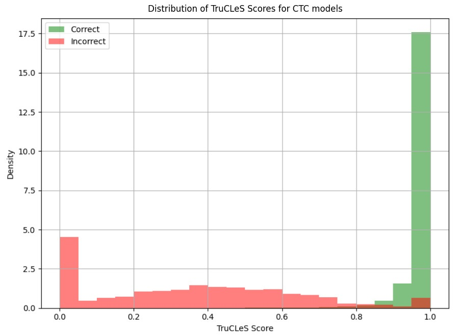
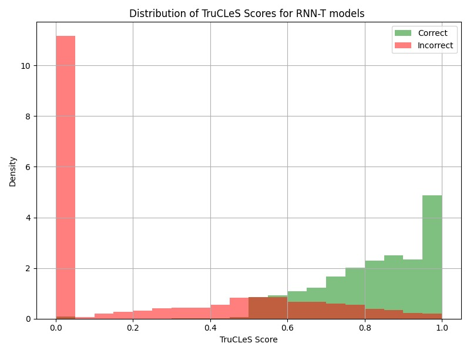

# TruCLeS: True Class Lexical Similarity for Confidence Estimation in ASR

This repository presents TruCLeS, a novel approach for confidence estimation in Automatic Speech Recognition (ASR) systems. TruCLeS proposes a continuous target score for training auxiliary Confidence Estimation Models (CEMs), combining - True class probability and Lexical similarity between predicted and ground truth transcripts.

TruCLeS is validated on both CTC and RNN-T based ASR models.

This work has been accepted at Interspeech 2025 - [Link to paper] (to be uploaded soon).

### Score Distribution: Correct vs Incorrect Words

The figure below illustrates how **TruCLeS** enables better separation between correct and incorrect predicted words in CTC-ASR model.

  
   <em>Figure: Score distribution: CTC-ASR model</em>

  
   <em>Figure: Score distribution: RNN-T-ASR model</em>

Evaluation on PB-Hindi Dataset

The table below presents the performance of various CTC-ASR based CEMs on the PB-Hindi dataset. 

| **Metrics**     | **Class Prob.** | **Entropy** | **CEM MLP** | **CEM Trans** | **TeLes**     | **TruCLeS**   |
|-----------------|------------------|-------------|--------------|----------------|----------------|----------------|
| **MAE ↓**       | 0.1238           | 0.2558      | 0.2205       | 0.2042         | **0.0917**     | 0.1005         |
| **KLD ↓**       | 0.3925           | 0.2516      | 0.1768       | 0.2091         | 0.1887         | **0.1627**     |
| **JSD ↓**       | 0.2325           | 0.1258      | 0.2274       | 0.2193         | 0.1001         | **0.0368**     |
| **NCE ↑**       | -0.1902          | -0.0199     | 0.1075       | 0.0854         | 0.0913         | **0.1919**     |
| **ECE ↓**       | 0.2607           | 0.2113      | 0.2919       | 0.2683         | 0.1142         | **0.0475**     |
| **MCE ↓**       | 0.3935           | 0.2278      | 0.2897       | 0.2183         | 0.2279         | **0.1831**     |
| **AUC-ROC ↑**       | 0.7994           | 0.8023      | 0.4033       | 0.4349         | 0.7339         | **0.8383**     |
| **AUPRC ↑**       | 0.9034           | 0.9219      | 0.8355       | 0.8419         | 0.9317         | **0.9660**     |

The table below presents the performance of various RNNT-ASR based CEMs on the CVE dataset. 

| **Metrics**     | **Baseline.** | **TruCleS** |
|-----------------|------------------|-------------|
| **MAE ↓**       | 0.0639           | 0.1489      |
| **KLD ↓**       | 0.1631           | 0.1584      |
| **JSD ↓**       | 0.0419           | 0.0392      |
| **NCE ↑**       | 0.7011          | 0.3012     |
| **ECE ↓**       | 0.0259           | 0.0191      |
| **MCE ↓**       | 0.0878           | 0.0614      | 
| **AUC-ROC ↑**       | 0.7963           | 0.9017      | 
| **AUPRC ↑**       | 0.9383           | 0.9750      |  
